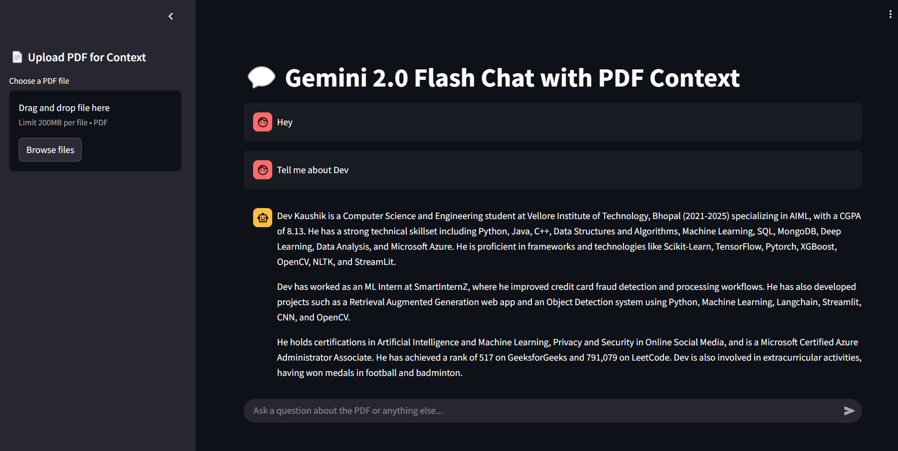

# 🤖 AskGemini AI - PDF Chat App

**AskGemini AI** is a powerful document-based Question Answering (QA) application built with Streamlit and Google’s **Gemini 2.0 Flash** API. It allows users to upload PDF files, extract content using `pdfplumber`, and ask questions in a chat interface powered by generative AI.

---

## 🚀 Features

- 📄 **PDF Upload via Sidebar**: Upload PDF documents directly in the sidebar for contextual QA.
- 🧠 **Contextual QA with Gemini**: Answers are generated by Google’s Gemini model, using uploaded PDF content as context.
- 💬 **Interactive Chat Interface**: ChatGPT-like experience with chat history and assistant/user styling.
- ⚡ **Streaming Responses**: Gemini replies stream in real-time, just like a real assistant.
- 🌐 **Modern UI**: Clean layout, scrollable chat view, persistent session memory.

---

## 📸 Working Demo

> _Upload a document → Ask anything → Get smart, contextual answers in seconds._

---
